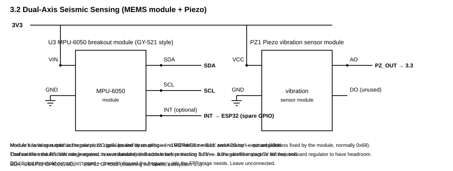
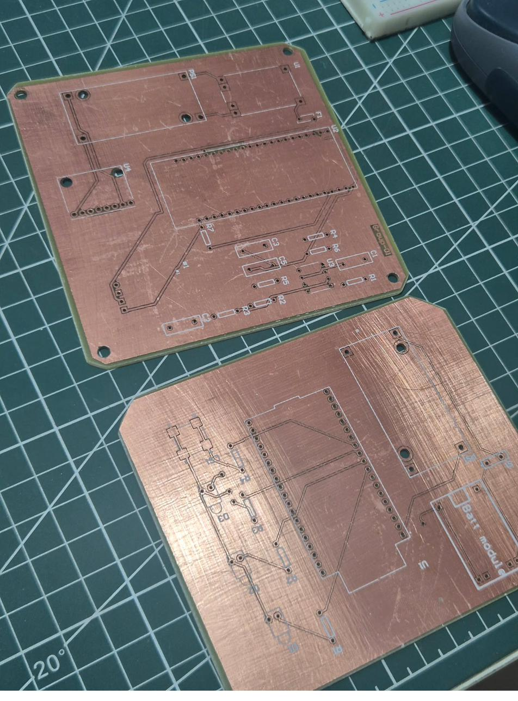
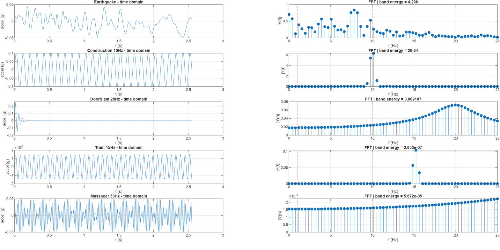

# Dual-Sensor Seismic Alert System

A prototype that combines a piezoelectric vibration sensor and an MPU-6050 accelerometer to trigger a local audible and visual alert. The project includes a breadboard firmware implementation, a separate FFT simulation path, circuit diagrams, etched PCB photos, and MATLAB signal analysis.

## Design overview

The intended architecture has a sensing node and an alarm/gateway node. The sensing node conditions the piezo signal, reads the accelerometer, and evaluates sensor agreement; the gateway design provides LEDs and a buzzer. The two PCB layouts were etched and drilled but are **unpopulated**. The demonstrated setup runs on **one breadboarded ESP32** with USB power.

| Path | What it does | Status |
|---|---|---|
| [RMS alarm firmware](firmware/Seismic_RMS_Alarm/Seismic_RMS_Alarm.ino) | Calibrates both sensors, evaluates RMS thresholds within a 500 ms agreement window, and latches the alarm | Breadboard demonstration |
| [FFT simulation firmware](firmware/Seismic_FFT_ProteusSim/Seismic_FFT_ProteusSim.ino) | 256 samples at 100 Hz, Hamming window, bins 3–25; simulated gateway confirmation | Proteus simulation on an Arduino Mega stand-in |
| [MATLAB validation](matlab/Seismic_FFT_Validation.m) | Compares in-band energy across earthquake and nuisance-vibration examples | Analysis script; original earthquake input file is not included |
| Two-node ESP-NOW and external event-feed cross-check | Communication and second-stage confirmation | Planned; not demonstrated |

### Hardware

*Piezo and MPU-6050 sensing arrangement.*

*Physical boards before components were installed. A [second angle](hardware/pcb-photos/etched_boards_angle_2.jpg) is also available.*

The [power](hardware/schematics/power_regulation.png), [ESP32 gateway](hardware/schematics/esp32_gateway.png), and [alarm indicator](hardware/schematics/alarm_indicator.png) schematics document the other stages. The [BOM](BOM.md) lists the main parts.

### Signal analysis

*Saved MATLAB comparison figure. The 10 Hz construction example has more in-band energy than the earthquake example, illustrating why frequency content alone cannot decide whether an event is seismic. The raw earthquake sample used for the saved figure is absent from this repository; without `quake_signal.txt`, the MATLAB script substitutes a synthetic burst.*

## Known limitations

- The ESP-NOW link, populated two-board hardware, battery operation, and external event-feed confirmation remain untested or unimplemented.
- The LM2596 buck stage needs input headroom above a single-cell LiPo's 3.0–4.2 V range; the demonstrated setup used regulated USB power.
- The sensing board's F1 fuse footprint is not wired through a protective device in the documented revision. Do not treat it as fused.
- The piezo bias target was 0.889 V, but 0.22 V was measured during breadboard bring-up. This can clip negative-going samples; the firmware reports clipping but does not repair the hardware bias.
- The RMS firmware is separate from the FFT prototype. The archived signal figure and sketches do not establish real-world earthquake detection performance or provide a dependable public-warning system.

## Run the code

Open either `.ino` file from its matching sketch folder in Arduino IDE or `arduino-cli`:

- **RMS sketch:** ESP32 board package, `Adafruit MPU6050`, and `Adafruit Unified Sensor`. The sketch uses GPIO34 for piezo ADC input, default I2C for the MPU-6050, GPIO25/26/27 for LEDs, and GPIO14 for buzzer PWM. Check the exact ESP32 board's pin availability and voltage levels before wiring.
- **FFT sketch:** Arduino Mega 2560 stand-in used in Proteus; requires `arduinoFFT` v2. Its simulated confirmation timer is not an ESP-NOW implementation.
- **MATLAB script:** run `matlab/Seismic_FFT_Validation.m`. Supply an 850-sample `quake_signal.txt` in that directory to reproduce the archived earthquake-input analysis; otherwise the script uses its documented synthetic fallback.

## Repository contents

`firmware/` contains the two sketches; `matlab/` contains the FFT comparison script; `hardware/schematics/` has the exported circuit figures; `hardware/pcb-photos/` shows the unpopulated boards; `docs/figures/` contains the saved analysis figure. CAD project backups and identifying course documents are outside this source-and-demonstration repository.
